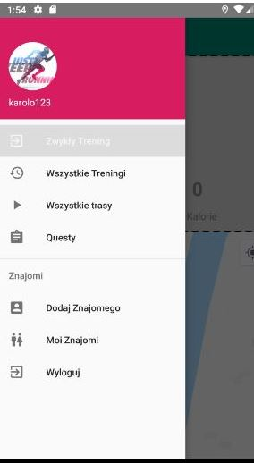
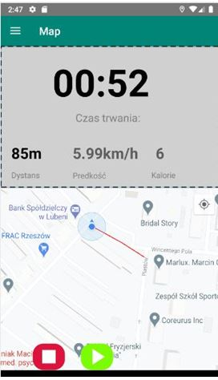
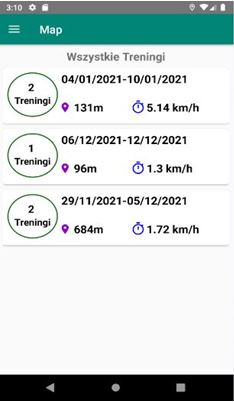
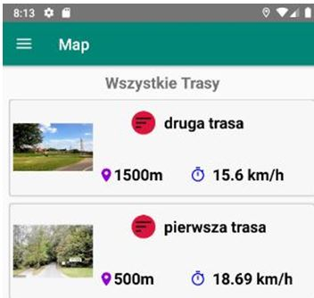
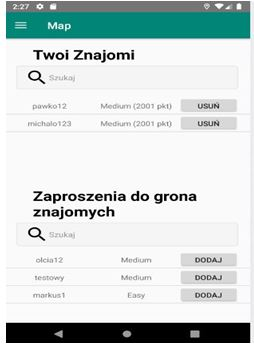
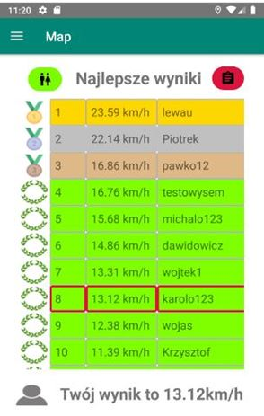
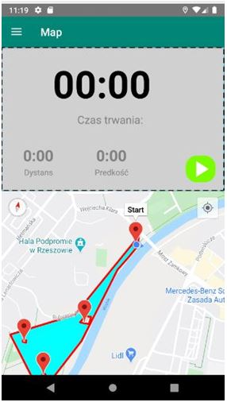

# Challenge

## Description
Mobile application that offers users an opportinity of rivaling on routes with others.Application includes possibility of carrying out training tasks, likewise in other similar apps.Moreover, applications includes social media option, which means comparing gained scores with others' progress.
## Functionalities

<ul>
<li>
Authentication
  <ul>
    <li>Login</li>
    <li>Registration</li>
  </ul>
</li>

  <li>
Make Trainings
  <ul>
    <li>Count distance,speed etc..</li>
    <li>Draw route line behind user</li>
    <li>Detailed history of trainings divide by weeks</li>
  </ul>
</li>
<li>
  
Competition
  <ul>
    <li>Analyze route</li>
    <li>Limits of route</li>
    <li>Checkpoints on route with scoreboard on every checkpoint </li>
    <li>Different types of scoreboard </li>
    <li>Earn rating points</li>
  </ul> 
</li>
<li>  
Friends
  <ul>
    <li>Add Friends</li>
    <li>Accept Request</li>
    <li>Delete Friend from List</li>
    <li>Show rate of friend </li>
  </ul> 
</li>
</ul>
  
## Technology stack

<ul>
  <li>Java(Android Studio)</li>
  <li>Firebase</li>
  <li>Glide</li>
  <li>ButterKnifel</li>
  
</ul>  

## Screens From App
A few photos from app

1. Poll 
  
2.Drawer Layout 
 
3.Personal training 
 
4.History of trainings 
 
5.Choice route 
 
6.List of Friends 
 
7.Scoreboard 
 
8.View of route 
 
