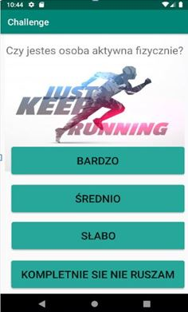

# Challenge

## Description
Application allows users to create and read blogs. Its possibility give like, because created reputation system and an option to comment specyfic post.It also has social media aspect that might help to communicate with each other users thanks to chat beetween users.
## Functionalities

<ul>
<li>
Authentication
  <ul>
    <li>Login</li>
    <li>Registration</li>
  </ul>
</li>
<li>
Blog
  <ul>
    <li>Creating blogs by logged user</li>
    <li>Give likes by logged user</li>
    <li>Viewing detail of post with number of likes and comments </li>
    <li>Creating comment of post by logged </li>
    <li>Viewing other blog</li>
    <li>Possibilty of delete,update created posts</li>
  </ul> 
</li>
<li>  
Chat
  <ul>
    <li>Chat for logged Users</li>
    <li>Searching by name</li>
  </ul> 
</li>
</ul>
  
## Technology stack

<ul>
  <li>Java(Android Studio)</li>
  <li>Firebase</li>
  <li>Glide</li>
  <li>ButterKnifel</li>
  
</ul>  

## Screens From App
A few photos from app

1. Poll 
  
2.Drawer Layout 
 
3.Personal training 
 
4.History of trainings  
 
5.List of Friends 
 
7.Scoreboard 
 
8.View of route 
 
